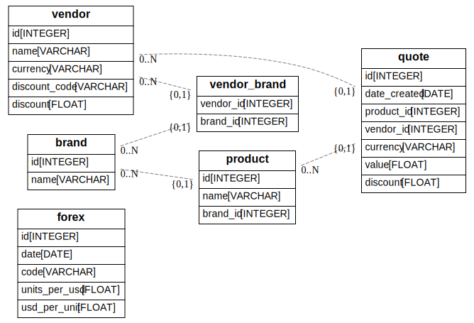

# buyer-log

Intended is a commandline tool to capture quotes, purchases of products from online vendors.

## Demo Session

```sh
% buyer add brand apple
% buyer add product apple iphone-14
% buyer add vendor amazon.com buyer.com
% buyer add quote amazon.com iphone-14 600 USD
% buyer add quote buyer.com iphone-14 600 USD
```

## Roadmap

- [ ] **Command Line Interface (CLI)**
  - [ ] Interactive REPL for buying support
  - [ ] Batch processing capabilities
  - [ ] Configuration management

- [ ] **Data Persistence**
  - [ ] SQLite for local development and testing
  - [ ] PostgreSQL for production deployments
  - [ ] Data migration and backup utilities

- [ ] **Inventory Management**
  - [ ] Track purchased items with metadata
  - [ ] Purchase history and warranty tracking
  - [ ] Stock level monitoring
  - [ ] Item categorization and tagging

- [ ] **Price Monitoring & Web Scraping**
  - [ ] Automated vendor price tracking
  - [ ] Price history and trend analysis
  - [ ] Price drop alerts and notifications
  - [ ] Multi-vendor price comparison

- [ ] **Report Generation**
  - [ ] **Quote Analysis**
    - [ ] Side-by-side vendor comparisons
    - [ ] Total cost calculations (including shipping/taxes)
    - [ ] Best value recommendations
  - [ ] **Shipping & Logistics**
    - [ ] Cost attribution by destination
    - [ ] Delivery time estimates
    - [ ] Shipping method optimization
  - [ ] **Financial Management**
    - [ ] Budget tracking and limits
    - [ ] Expense categorization
    - [ ] Discount code tracking and application
    - [ ] Purchase approval workflows
  - [ ] **Analytics & Insights**
    - [ ] Sales pattern analysis
    - [ ] Seasonal price trends
    - [ ] Vendor performance metrics
    - [ ] Spending analytics and reports
  - [ ] **Export Formats**
    - [ ] Excel (XLSX) with pivot tables
    - [ ] HTML reports for web viewing
    - [ ] PDF reports for documentation
    - [ ] JSON/CSV for data integration

- **Advanced Features**
  - Multi-currency support with real-time exchange rates
  - Vendor relationship management
  - Purchase approval workflows
  - Integration with accounting systems
  - API for third-party integrations

## Current Model


